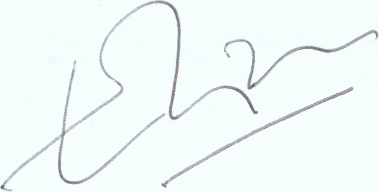
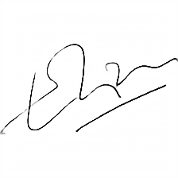
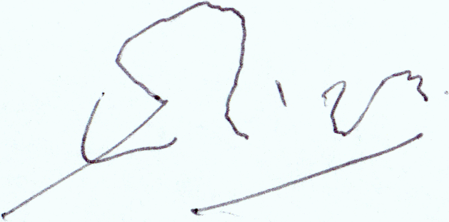
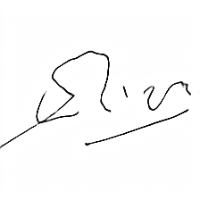

## Why this project
I want a method to verify if an handwritten signature is genuine or forged.
I've googled a lot and found some papers about this topic.
I've found many papers and finally I've found these two projects on Kaggle:
- Signature Image Cleaning with Tensorflow 2.0 - https://www.kaggle.com/code/victordibia/signature-image-cleaning-with-tensorflow-2-0
- Siamese signature verification with confidence - https://www.kaggle.com/code/medali1992/siamese-signature-verification-with-confidence

I've created another repo on Github to use output models from previous Kaggle projects and convert them to ONNX format:
- https://github.com/mapo80/signature-verification-models

I've converted these models to ONNX format, so to use them in this c# project.

## How to use it

### To clean signature images
- Use the `SignatureImageCleaner` class to clean signature images.
There are two methods that accept stream or byte array as input.
Return images have 224x224 size.
Below some examples:

#### First example

#### Second example

### To verify signatures
- Use the `SignatureVerifier` class to verify signatures.
There's one method to verify two signatures.
`VerifySignatures(Stream sourceImage1, Stream sourceImage2)`

It doesn't use previous method to clean signature image but it uses a different one, same used on kaggle notebook.
Preprocessing filters are:
- GaussianBlur
- Otsu threshold and binarized image to fine center of mass and minimun area to contain signature
- Center image on canvas size
- Normalize image and remove all noise using otsu threshold
- Resize image and crop to center

These preprocessing methods are same used on original system.
Here are more details:
- https://github.com/luizgh/sigver

## Final results
I've tested this project with all test signatures provided on kaggle notebook dataset:
- https://www.kaggle.com/code/medali1992/siamese-signature-verification-with-confidence/input

All signatures are in `test` folder.

Inside `test_data_results.csv` are all results of this project.
Info contained are:
- `Image1` and `Image2` are the two signatures used to verify
- `IsForged` If image is forged or not
- `CalculatedResult` calculated result from siamese network
- `IsSameResult` if it's same result as dataset
- `Confidence` is the confidence of verification calculated by model
- `Similarity` is the similarity of verification calculated by model

To determine if a signature is forged or not has been used `Similarity`, if this value is < 0.5 then is forged.

## Results
Below there are results:

- Accuracy: 0.6399921352732992
- Precision: 1
- Recall: 0.30957767722473606
- F1-Score: 0.47279009501871583

This model is not perfect, but it's a good start to verify signatures.
