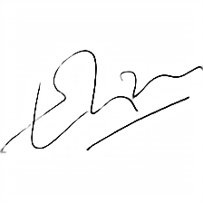
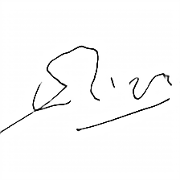

## Why this project
I want to method to verify if an handwritten signature is genuine or forged.
I've googled a lot and found some papers about this topic, but I'm not sure if they are the best way to do it.

I've found many papers and finally I've found these two projects on Kaggle:
- Signature Image Cleaning with Tensorflow 2.0 - https://www.kaggle.com/code/victordibia/signature-image-cleaning-with-tensorflow-2-0
- Siamese signature verification with confidence - https://www.kaggle.com/code/medali1992/siamese-signature-verification-with-confidence

I've created another repo on Github to use output models from previous Kaggle projects and convert them to ONNX format:
- https://github.com/mapo80/signature-verification-models

I've converted these models to ONNX format, so to use them in this c# project.

## How to use it

### To clean signature images
- Use the `SignatureImageCleaner` class to clean signature images.
There are two methods that accept stream or byte array as input.
Return images have 224x224 size.
Below some examples:

#### First example

#### Second example

### To verify signatures
- Use the `SignatureVerifier` class to verify signatures.
There's one method to verify two signatures.
`VerifySignatures(Stream sourceImage1, Stream sourceImage2)`

It doesn't use previous method to clean signature image but it uses a different one, same used on kaggle notebook.
Preprocessing filters are:
- GaussianBlur
- Otsu threshold and binarized image to fine center of mass and minimun area to contain signature
- Center image on canvas size
- Normalize image and remove all noise using otsu threshold
- Resize image and crop to center

These preprocessing methods are same used on original system.
Here are more details:
- https://github.com/luizgh/sigver

## Final results
I've tested this project with all test signatures provided on kaggle notebook dataset:
- https://www.kaggle.com/code/medali1992/siamese-signature-verification-with-confidence/input

All signatures are in `test` folder.

Inside `test_data_results.csv` are all results of this project.
Info contained are:
- `Image1` and `Image2` are the two signatures used to verify
- `IsForged` If image is forged or not
- `CalculatedResult` calculated result from siamese network
- `IsSameResult` if it's same result as dataset
- `Confidence` is the confidence of verification calculated by model
- `Similarity` is the similarity of verification calculated by model

To determine if a signature is forged or not has been used `Similarity`, if this value is < 0.5 then is forged.

## Results
Below there are results:

- Accuracy: 0.6399921352732992
- Precision: 1
- Recall: 0.30957767722473606
- F1-Score: 0.47279009501871583

This model is not perfect, but it's a good start to verify signatures.